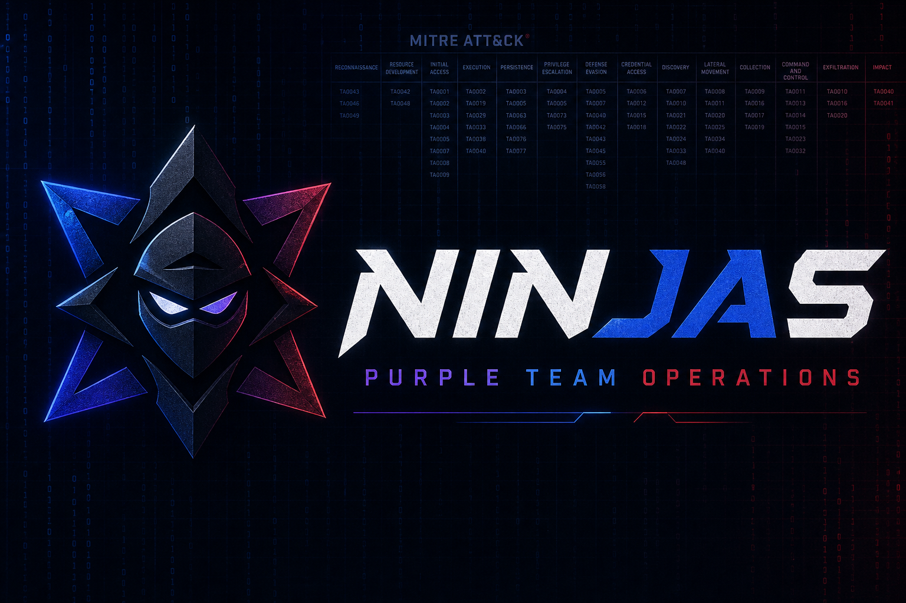
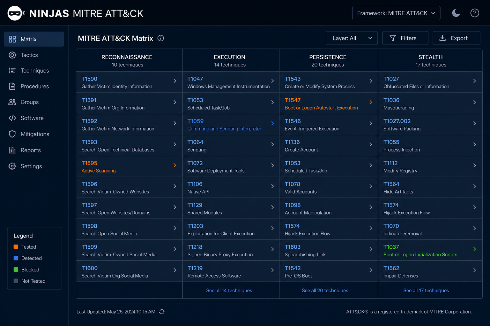

<p align="center">
  
</p>

<h1 align="center">NINJAS MITRE ATT&CK Board</h1>

<p align="center">
  <strong>Local MITRE matrix for Purple & Red Team operations — track TTPs, notes, and coverage.</strong>
</p>

<p align="center">
  
  
  
  
</p>

---

## Overview

**NINJAS MITRE Board** is a self-hosted web app for tracking MITRE ATT&CK techniques during Purple Team and Red Team engagements. Browse the full Enterprise matrix locally, annotate every TTP with operational notes, and visualize what you've tested, detected, blocked, or missed.

Built for teams who want a private, offline-friendly alternative to MITRE Navigator — without sending engagement data to the cloud.

<p align="center">
  
</p>

---

## Features

| Feature | Description |
|---------|-------------|
| **Full MITRE coverage** | 697 TTPs — 222 techniques + 475 sub-techniques |
| **MITRE-style matrix** | Column layout matching official ATT&CK Navigator |
| **Operational notes** | Status, team perspective, assignee, tags, free-text notes |
| **Purple / Red / Blue tracking** | Tested · Detected · Blocked · Missed · In Progress |
| **Light & dark theme** | Toggle with persistent preference |
| **Authentication** | Login gate — no unauthorized edits |
| **Local-first** | Data stored in `data/notes.json` on your machine |
| **Export** | Download notes as JSON for backup or reporting |

---

## Quick Start

### Prerequisites

- [Node.js](https://nodejs.org/) 18+
- MITRE Enterprise ATT&CK STIX bundle → `data/enterprise-attack.json`

### Install & run

```bash
git clone <your-repo-url>
cd Mitre-Tamin
npm install
npm start
```

Open **http://localhost:8002/login**

### Default credentials

| Field | Value |
|-------|-------|
| Username | `NINJAS` |
| Password | `NINJAS` |

> Change these before exposing the app to a network. Copy `.env.example` → `.env` and set strong values.

```bash
cp .env.example .env
# Edit .env:
# AUTH_USER=NINJAS
# AUTH_PASSWORD=your-strong-password
# SESSION_SECRET=long-random-string
```

---

## Usage

### Operation statuses

| Status | Meaning | Typical owner |
|--------|---------|---------------|
| **Tested** | TTP was executed | Red Team |
| **Detected** | Activity was observed | Blue / Purple |
| **Blocked** | Control prevented execution | Blue Team |
| **Missed** | Gap — no detection/block | Purple Team |
| **In Progress** | Currently being worked | Anyone |

Cells change color on the matrix when a status is set. A gold dot indicates a written note.

### Keyboard shortcuts

| Key | Action |
|-----|--------|
| `Ctrl + S` | Save note |
| `Esc` | Close drawer |

---

## Project structure

```
.
├── docs/
│   └── banner.png          # README header image
├── data/
│   ├── enterprise-attack.json   # MITRE STIX bundle (not in git — download separately)
│   └── notes.json               # Your team's operational notes
├── public/
│   ├── index.html          # Main matrix UI
│   └── login.html          # Login page
├── server.js               # Express API + auth
├── .env.example            # Credential template
└── README.md
```

---

## MITRE data

Download the latest **Enterprise ATT&CK** STIX JSON from [MITRE CTI GitHub](https://github.com/mitre/cti) and place it at:

```
data/enterprise-attack.json
```

The app parses tactics, techniques, and sub-techniques locally — no outbound calls required after setup.

---

## API (authenticated)

| Method | Endpoint | Description |
|--------|----------|-------------|
| `GET` | `/api/mitre` | Full matrix data |
| `GET` | `/api/mitre/:id` | Technique detail |
| `GET` | `/api/notes` | All notes |
| `PUT` | `/api/notes/:id` | Save note for a TTP |
| `DELETE` | `/api/notes` | Clear all notes |
| `POST` | `/api/auth/login` | Sign in |
| `POST` | `/api/auth/logout` | Sign out |

---

## Security notes
- Run behind HTTPS if exposed beyond localhost

---

## Team

Built for **NINJAS** — Purple Team operations, adversary emulation, and detection validation.

<p align="center">
  <sub>MITRE ATT&CK® is a registered trademark of The MITRE Corporation.</sub>
</p>
